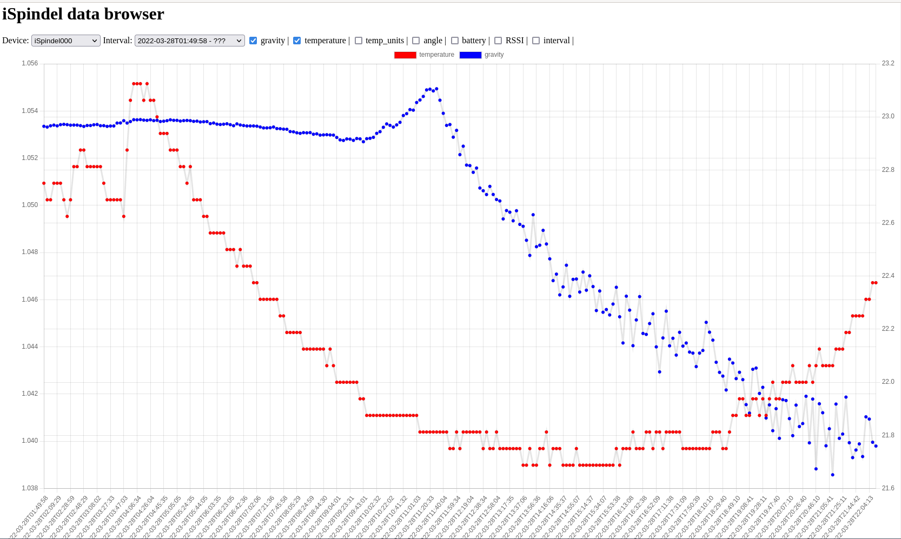

# Simple TCP iSpindel data grabber and visualiser
This set of scripts allows you to store and process data from [iSpindel](http://ispindel.de) (smart hydrometer). It doesn't support any kind of data forwarding or else - it just collects the data, stores them in .csv files and generates webpage with charts (using [Charts.js](https://www.chartjs.org/)) library, and was created solely to "keep it simple", after finding way too many projects depending on full blown DBMS, which I don't like running on my Raspberry Pi "server"...


## Software setup
1. Modify server.py if you need to change the listening port of the server (by default it's 8081), and authorization token.
2. Run install.sh
3. Configure iSpindel to report data via TCP to the IP of the machine you're running the server on. Our server script checks the token, so it must match as well.
4. Configure webserver to enable cgi-bin scripting, and use `/usr/local/lib/cgi-bin` as `/cgi-bin/`directory.
5. Make /var/www/html/ispindel directory available via a webserver.
6. Hopefully done

## Example lighttpd config
```
server.modules += (
        "mod_cgi"
)
$HTTP["url"] =~ "^/cgi-bin/" {
        cgi.assign = ( ".cgi" => "",
                       ".py" => "/usr/bin/python" )

}
```

## Browser screenshot



